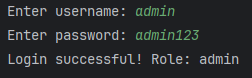
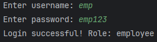
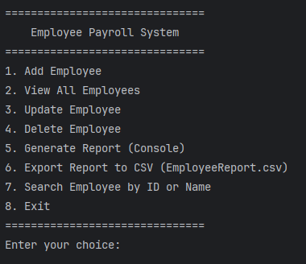
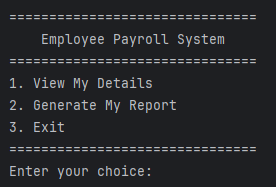
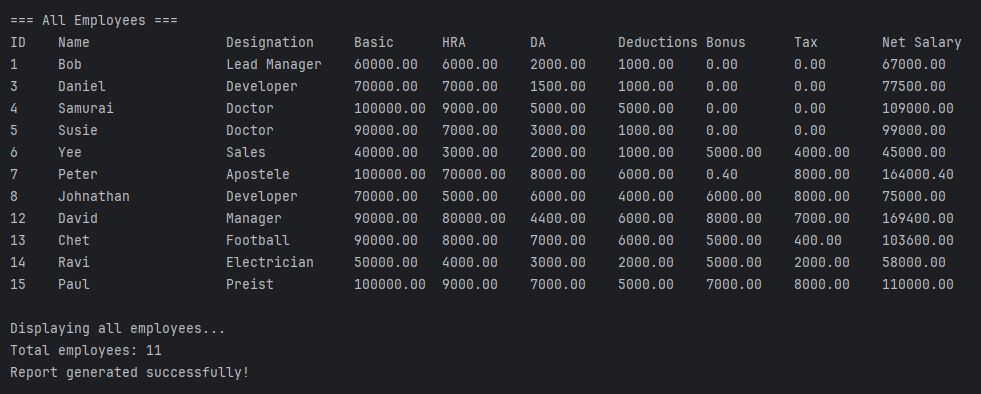
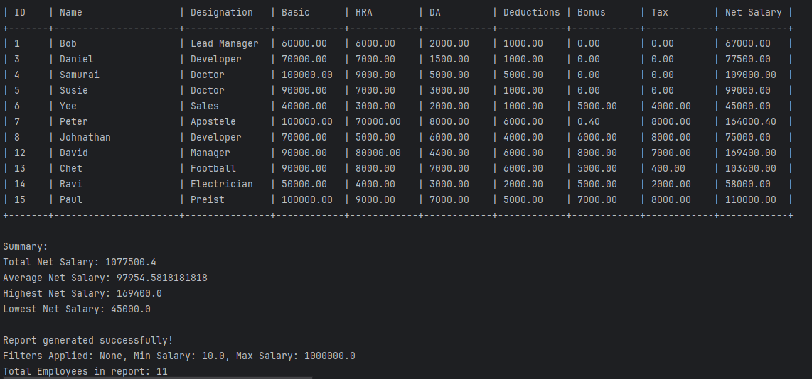

# Employee Payroll Management System

A **Java-based payroll management system** built with **JDBC and MySQL**, designed for both **Admin** and **Employee** roles.  
It provides secure login, salary calculation, CRUD operations on employees, reporting, and CSV export.  
This project demonstrates **Core Java, JDBC, database integration, role-based access, and error handling**   


## Features

- **Role-Based Access**
  - **Admin**: Full access to manage employees and generate reports.  
  - **Employee**: Limited access to view personal details and reports.  

- **CRUD Operations**
  - Add new employees  
  - View all employees (Admin) / View personal details (Employee)  
  - Update employee details  
  - Delete employee records  

- **Payroll Calculations**
  - `Net Salary = (Basic + HRA + DA + Bonus) – (Deductions + Tax)`  

- **Reports**
  - Generate payroll reports (console-based, tabular format)  
  - Apply filters (designation, salary range)  
  - Export reports to CSV  

- **Search Functionality**
  - Search by Employee ID or Name  

- **Validation & Error Handling**
  - Prevents negative salary/bonus/tax values  
  - Empty names/designations not allowed  
  - Confirmation prompts before delete and exit  

- **Navigation**
  - After each operation, return to the main menu or exit
 


 
##  Screenshots  

### 1. Login Page  
<p float="left">
  
  
</p>


### 2. Admin Menu  


### 3. Employee Menu  


### 4. View All Employees  


### 5. Generate Report  



## Tech Stack

- Java (Core + JDBC) – Backend logic and database connectivity  
- MySQL – Database management  
- IntelliJ IDEA – Development environment  
- Git & GitHub – Version control and hosting


 ## Project Structure
 ```
PayrollSystem/
│── src/
│   ├── dao/
│   │   ├── EmployeeDAO.java
│   │   └── UserDAO.java
│   ├── model/
│   │   ├── Employee.java
│   │   └── User.java
│   ├── util/
│   │   └── DBConnection.java
│   └── main/
│       └── PayrollSystem.java
│── database.sql         
│── README.md   
│── screenshots/         

```


## Database Setup

Run the following SQL script (`database.sql`) in MySQL:

```sql
CREATE DATABASE payroll_db;

USE payroll_db;

CREATE TABLE employee (
    emp_id INT AUTO_INCREMENT PRIMARY KEY,
    name VARCHAR(50),
    designation VARCHAR(50),
    basic_salary DOUBLE,
    hra DOUBLE,
    da DOUBLE,
    deductions DOUBLE,
    bonus DOUBLE DEFAULT 0,
    tax DOUBLE DEFAULT 0,
    net_salary DOUBLE
);

CREATE TABLE users (
    user_id INT AUTO_INCREMENT PRIMARY KEY,
    username VARCHAR(50) UNIQUE NOT NULL,
    password VARCHAR(100) NOT NULL,
    role ENUM('admin', 'employee') NOT NULL,
    employee_id INT
);

-- Insert sample users
INSERT INTO users (username, password, role, employee_id)
VALUES 
('admin', 'admin123', 'admin', NULL),
('emp', 'emp123', 'employee', 1);
```


##  How to Run

1. **Clone this repository:**
   ```bash
   git clone https://github.com/Sumeeth11/payroll-system.git
2. **Open the project in IntelliJ IDEA (or Eclipse).**

3. **Set up the database:**
Open MySQL Workbench or terminal.
Run the database.sql script provided in this repo to create the schema and tables.

4. **Update DB credentials in DBConnection.java with your MySQL username and password:**
connection = DriverManager.getConnection(
    "jdbc:mysql://localhost:3306/payroll_db", "root", "Sumeeth@2003");

5. **Compile and run the main class:**
PayrollSystem.java

6. **Login credentials (sample):**
Admin → username: admin, password: admin123
Employee → username: emp, password: emp123


## Author


**Sumeeth Sangat**

-  [Email](mailto:sumeethsangat@gmail.com)  
-  [GitHub](https://github.com/Sumeeth11)  
-  [LinkedIn](https://www.linkedin.com/in/sumeethsangat)  

